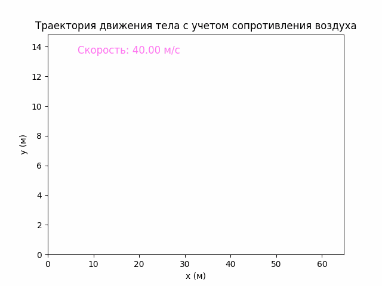
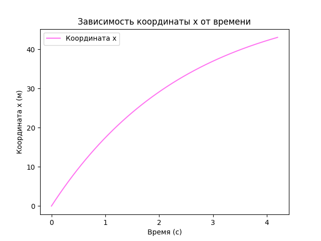
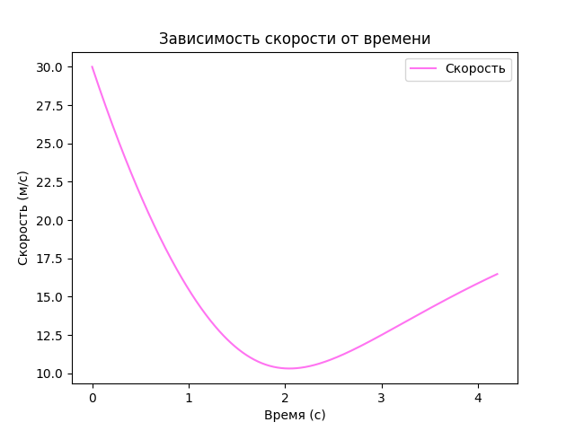
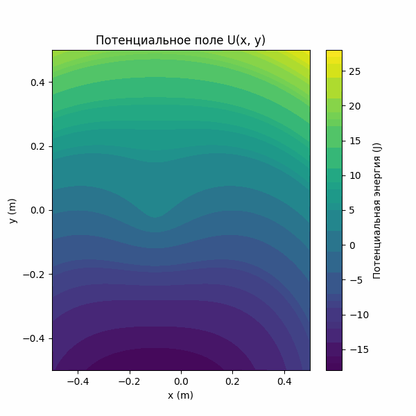

# Physics-LectionTask-5-6-7
# Задание 1

> Моделирование движения тела, брошенного под углом к горизонту с учетом силы
сопротивления воздуха. Сила сопротивления воздуха пропорциональна скорости
движения тела $\vec𝐹 = −𝑘\vec𝜐$ . 
>Входные параметры: 
>+ начальная скорость
>+ угол между вектором скорости и линией горизонта
>+ высота, с которой брошено тело
>+ коэффициент сопротивления среда 𝑘 
>>Результат: графики (траектория движения тела, зависимость скорости и координат от
времени)
Обосновать выбранный способ решения ОДУ численными методами (пояснить, какой метод
был использован и почему). 

## Теоретическое обоснование

Рассмотрим движение тела, брошенного под углом к горизонту с учетом силы сопротивления воздуха, которая пропорциональна скорости движения тела и описывается формулой:

$\vec{F} = -k \vec{\nu}$

где:
- $k$— коэффициент сопротивления воздуха,
- $\vec{\nu}$ — вектор скорости тела.

С учетом силы сопротивления воздуха, уравнения движения тела в проекциях на оси \( x \) и \( y \) можно записать как систему дифференциальных уравнений второго порядка:

$m \frac{d v_x}{dt} = -k v_x$

$m \frac{d v_y}{dt} = -mg - k v_y$

где $g$ — ускорение свободного падения. Разделим обе стороны на массу  $m$ и получим ускорения по осям $x$ и $y$:

$a_x = -\frac{k}{m} v_x$

$a_y = -g - \frac{k}{m} v_y$

Таким образом, ускорение $a_x$ зависит от горизонтальной компоненты скорости $v_x$, а ускорение $a_y$ — от вертикальной компоненты скорости $v_y$ и гравитационного ускорения.

## Обоснование выбранного метода численного решения ОДУ

Для решения системы дифференциальных уравнений используется метод Рунге-Кутты 4-го порядка. Этот метод является одним из наиболее популярных и устойчивых методов для численного решения ОДУ. Преимущества метода:
- Высокая точность даже при сравнительно больших шагах интегрирования.
- Устойчивость при решении задач с изменяющимися ускорениями, как в данном случае (сила сопротивления и сила тяжести).

Метод Рунге-Кутты 4-го порядка позволяет рассчитать новое значение скорости и положения тела, учитывая среднее значение ускорения за каждый шаг интегрирования.

## Входные параметры

- **Начальная скорость** $v_0$ — скорость, с которой тело бросается.
- **Угол броска** $\theta$ — угол между вектором начальной скорости и горизонтом.
- **Высота броска**  $h$ — начальная высота над землей, с которой тело брошено.
- **Коэффициент сопротивления среды** $k$ — коэффициент пропорциональности силы сопротивления воздуха.

## Выходные данные

Программа выводит следующие графики:
- **Траектория движения тела** (анимация), где показан путь, пройденный телом с учетом сопротивления воздуха.
- **График зависимости скорости от времени** — показывает, как изменяется скорость тела в течение времени.
- **График зависимости координаты \( x \) от времени** — показывает, как изменяется горизонтальное положение тела со временем.

## Пример
Тело брошено с высоты 1.50 $м$, с начальной скоростью 40 $м/с^2$ под углом 40 градусов, при коэффициенте сопротивления воздуха 0.4.

# Задание 2
> Моделирование потенциального поля. Визуализировать двумерное распределение
потенциальное энергии U (x,y). Входные параметры: зависимость равнодействующей
всех сил, действующих на тело от координат $\vec𝐹(𝑥, 𝑦)$ . При моделировании можно
использовать известные силы из механики (упругости, гравитации, тяжести) или
неизвестные силы, выраженные, как степенные функции от координат. 

## Теоретическая часть
Силовой поле называют ***потенциальным***, если имеется силовая функция U, зависящая от координат точки и времени для нестационарного силового поля.

## Формулы

#### Сила тяжести
Сила тяжести действует на груз вертикально вниз:
$F_{\text{т}} = m \cdot g$

#### Сила упругости
Сила упругости определяется по закону Гука:
$F_{\text{упр}} = -k \cdot (r - L) \cdot \frac{\vec{r}}{r}$
где \( r \) — текущее расстояние от начала координат до точки, \( L \) — длина пружины в равновесии.

#### Потенциальная энергия системы
Полная потенциальная энергия \( U(x, y) \) складывается из:
1. **Потенциальной энергии упругости**:
   $U_{\text{упр}} = \frac{1}{2} k (r - L)^2$
2. **Потенциальной энергии силы тяжести**:
   $U_{\text{т}} = m \cdot g \cdot y$

Общая потенциальная энергия:
$U(x, y) = U_{\text{упр}} + U_{\text{т}}$

## Реализация

В коде рассчитывается результирующая сила и потенциальная энергия в зависимости от положения груза. Потенциальное поле визуализируется с использованием `matplotlib` в виде анимации, в которой цветовая шкала указывает значение потенциальной энергии в каждый момент времени. 

## Пример
Потенциальное поле при учете сил тяжести и упругости действующих на груз на пружине.
- \( m = 4 \) кг — масса груза,
- \( g = 9.81 \) м/с² — ускорение свободного падения,
- \( L = 0.3 \) м — длина пружины в равновесии,
- \( k = 100 \) Н/м — жесткость пружины.

## Источники
[eduspb.com](https://www.eduspb.com/node/1669)

[lisakov.com](https://lisakov.com/blog/air-resistance/)

[pashinin.com](https://baumanka.pashinin.com/IU2/sem4/%D0%A2%D0%B5%D1%80%D0%BC%D0%B5%D1%85/%D0%9B%D0%B5%D0%BA%D1%86%D0%B8%D0%B8/Nikitin/4%20%D0%9E%D0%B1%D1%89%D0%B8%D0%B5%20Th%20%D0%B4%D0%B8%D0%BD%D0%B0%D0%BC%D0%B8%D0%BA%D0%B8%20%D0%A2%20%D0%B8%20%D1%81%D0%B8%D1%81%D1%82/4.6%20%D0%9F%D0%BE%D1%82%D0%B5%D0%BD%D1%86-%D0%BE%D0%B5%20%D1%81%D0%B8%D0%BB%D0%BE%D0%B2%D0%BE%D0%B5%20%D0%BF%D0%BE%D0%BB%D0%B5.pdf)

[studFiles](https://studfile.net/preview/1967415/page:2/)